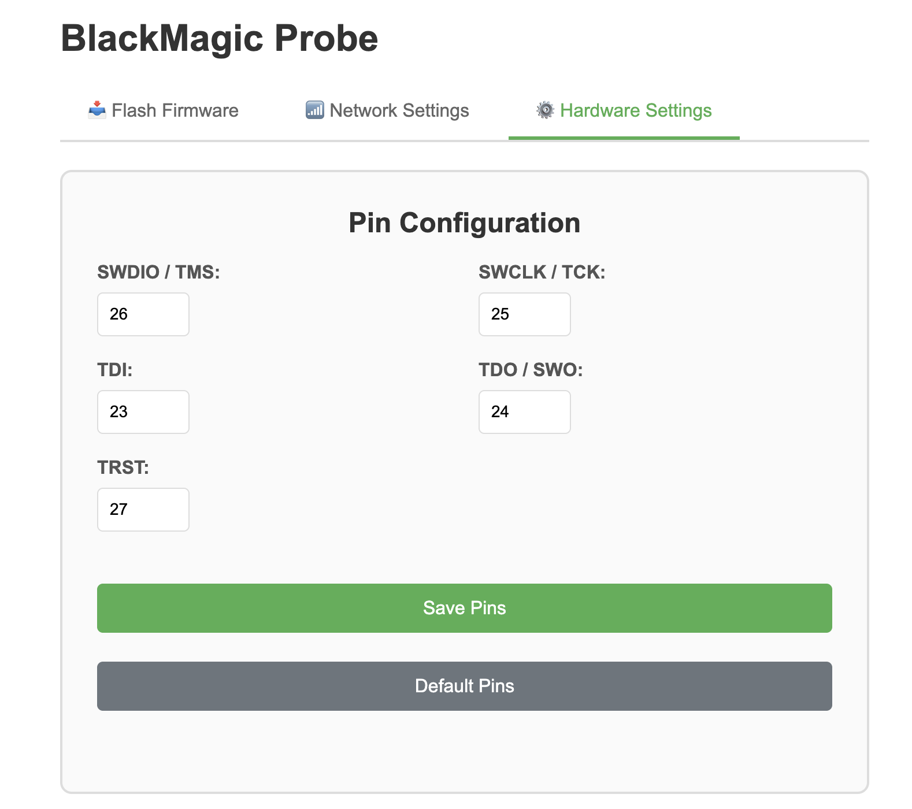
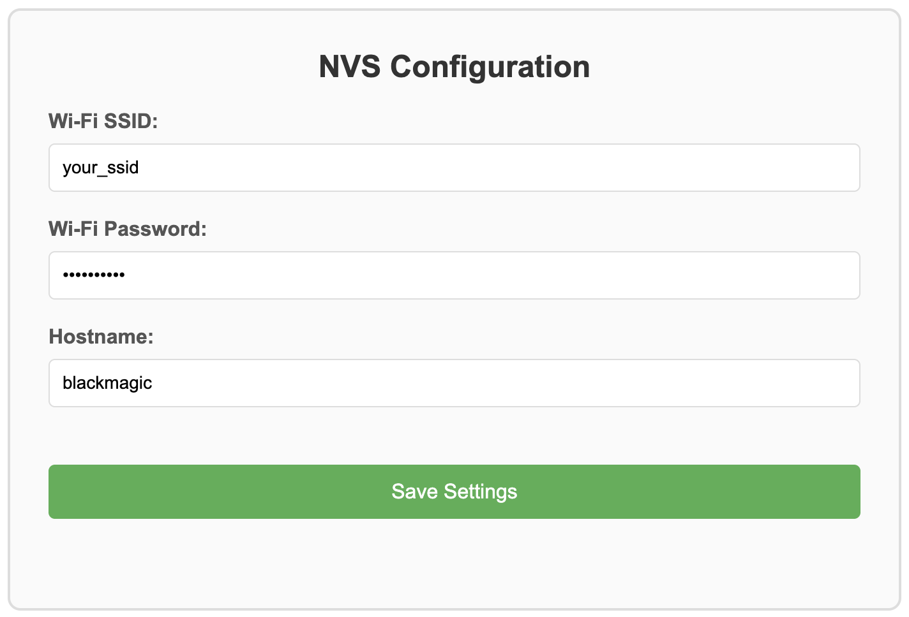

# blackmagic-esp32-c5

Black Magic Probe firmware for ESP32-C5 (and other ESP32-Cx chips). Turns the board into a wireless debug adapter: GDB connects over Wi-Fi, no OpenOCD required.

| Port | Purpose |
| --- | --- |
| `80` | Web UI — OTA flash, Wi-Fi credentials, GPIO pin assignment |
| `2345` | GDB remote serial protocol |
| `2346` | Segger RTT console (optional, see [RTT](#rtt)) |
| `2347` | Target serial (optional, see [Serial](#target-serial)) |

All settings (Wi-Fi credentials, hostname, GPIO pins) are stored in NVS and persist across reboots. They can be changed at runtime through the web UI.

## Building

```bash
idf.py build
idf.py flash monitor
```

All configuration in `sdkconfig.defaults` is applied automatically on first build (`sdkconfig` itself is generated and gitignored). To re-apply edited defaults to an existing checkout, delete `sdkconfig` and rebuild. The frontend (`npm install` + build) is also handled automatically by CMake — no manual steps needed.

### Building for a different chip

```bash
idf.py set-target esp32c6   # regenerates sdkconfig
idf.py build
```

### Why these sdkconfig.defaults settings

| Setting | Reason |
| --- | --- |
| `PARTITION_TABLE_SINGLE_APP_LARGE` (3 MB) | Firmware with all BMP targets exceeds 1 MB |
| `WHOLE_ARCHIVE` on esp32-platform component | Forces strong symbols from target probe files to win over weak stubs in `target_probe.c` |
| `CONFIG_ESP_INT_WDT=n`, `CONFIG_ESP_TASK_WDT_EN=n` | Flash and target probe operations exceed the default watchdog timeout |
| `CONFIG_ESP_CONSOLE_UART_DEFAULT=y`, `CONFIG_ESP_CONSOLE_SECONDARY_NONE=y` | Console and logs on UART0 only, keeping the USB-Serial-JTAG peripheral free for GDB over USB |

## Wi-Fi

On boot the device connects to the configured network (STA mode). If the connection fails within 5 seconds it falls back to a soft-AP:

| SSID | Password |
| --- | --- |
| `blackmagic` | `blackmagic` |

In STA mode the device is reachable as `blackmagic.local` via mDNS / NetBIOS.

## Usage

### GDB

```bash
$ arm-none-eabi-gdb firmware.elf
(gdb) target extended-remote blackmagic.local:2345
(gdb) monitor swdp_scan
(gdb) attach 1
```

### GDB over USB (USB-Serial-JTAG)

The same GDB server is also available over the built-in USB port — no Wi-Fi needed. Console logs stay on UART0, the USB peripheral is dedicated to GDB.

Linux:

```bash
(gdb) target extended-remote /dev/ttyACM0
```

macOS (list your device with `ls /dev/cu.usbmodem*`):

```bash
(gdb) target extended-remote /dev/cu.usbmodemXXXX
```

All `monitor` commands (`swdp_scan`, `rtt enable`, …) work the same as over Wi-Fi.

### RTT

RTT support is compiled in by default (`-DENABLE_RTT=1` in `CMakeLists.txt`). `ENABLE_RTT` is definition of BlackMagic. Enable it from the GDB session while the target is attached, then connect in a separate terminal:

```bash
(gdb) monitor rtt enable
(gdb) monitor rtt status   # confirm control block found
```

```bash
$ telnet blackmagic.local 2346
# or
$ nc blackmagic.local 2346
```

Use `-DENABLE_USB_GDB=1` for enable rtt by USB serial. 
It uses the *senior* port in `/dev`:
- `cu.usbmodem1`
- `cu.usbmodem3` - it's yours

```bash
socat - "/dev/cu.usbmodemXXXX,raw,echo=0,ispeed=115200,ospeed=115200"
# or
minicom # or ect.
```

### Target Serial

Connect to the target serial console in a separate terminal:

```bash
$ telnet blackmagic.local 2347
# or
$ nc blackmagic.local 2347
```

Use `-DENABLE_USB_GDB=1` and `-DENABLE_UART_SERIAL=1` for enable serial by USB serial. 
It uses the *minor* port in `/dev`:
- `cu.usbmodem1` - it's yours
- `cu.usbmodem3`

```bash
socat - "/dev/cu.usbmodemXXXX,raw,echo=0,ispeed=115200,ospeed=115200"
# or
minicom # or ect.
```

TODO! This port is used for ESP logging. Currently, they are conflicting. Will logging be disabled, or will the serial data be integrated into the logs?

## Default GPIO Pin Mapping

All pins are overridable at runtime through the web UI (stored in NVS).

| Signal | GPIO |
| --- | --- |
| SWDIO / TMS | 26 |
| SWCLK / TCK | 25 |
| TDI | 23 |
| TDO / TRACESWO | 24 |
| TRST | 27 |

SWD and JTAG share SWDIO/TMS and SWCLK/TCK lines (standard Black Magic Probe convention).

## Web UI


*Pin Configuration — set GPIO numbers for SWDIO, SWCLK, TDI, TDO and TRST.*


*Network Configuration — Wi-Fi SSID, password and device hostname.*

### Frontend development

See [frontend/README.md](frontend/README.md) for details.

## Run VS Code debugger with Black Magic Probe

[bm-vscode-configs](https://github.com/BareMetalTestLab/bm-vscode-configs) — ready-to-use VS Code project template for debugging with Black Magic Probe (with support RTT). Includes pre-configured `launch.json` for the [Cortex-Debug](https://marketplace.visualstudio.com/items?itemName=marus25.cortex-debug) extension. All project-specific paths and settings are centralized in `.vscode/settings.json`.
